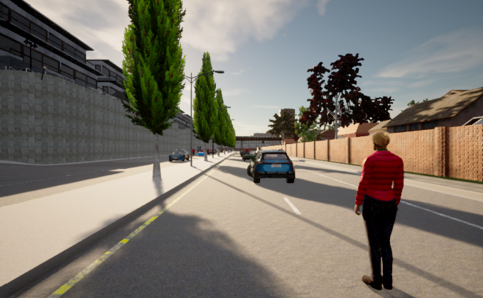
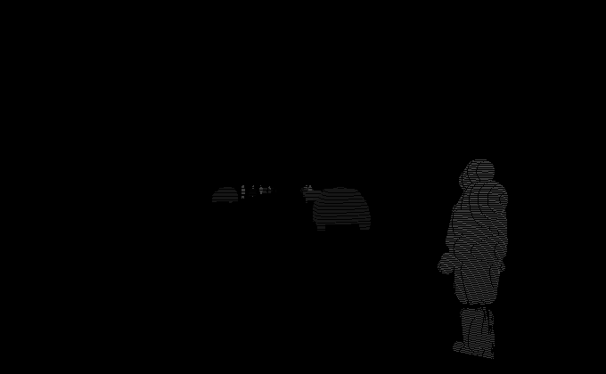

# Labelling_utilities

Simple utilities which can be used for labelling images for object detection and instance segmentation. 

### 1. 2D bounding boxes using instance segmentation

 Object detection is crucial for detecting and localizing dynamic objects such as Cars, Pedestrians in images.
 But some dataset may not necessarily provide ground truth for bounding boxes, but most often they do have other ground truth labels like instance segmentation.
 This [notebook](./bb_instance.ipynb) simply aims at automating the task of labelling bounding box using instance segmentation.
 
   a. **Input-**   KITTI - 360 dataset - (RGB images + instance segmentation)
 
   b. **Output-**   Bounding boxes for dynamic objects like cars and pedestrians
 
 
### 2. Generating 2D bounding boxes for Poles like structures using semantic segmentation and polygons

 Detecting static objects like poles are crucial for localization/ SLAM algorithms. In this [notebook](./bb_pole_semseg_poly.ipynb), the main focus is to detect the 
poles, more importantly the vertical part of poles. Once detected, distance to the poles can be obtained lidar projection or stereo depth images.
 
   a. **Input-**   Cityscapes dataset - (RGB images + semantic segmentation + polygon mask for poles)
 
   b. **Output-**   Bounding boxes for Pole 
 

### 3. Generating instance segmentation in camera images using Lidar ground truth
 
 Carla simulator offers, many ground truth generation options, but still there is no support for instance segmentaion for camera images. But they do provide instance segmentaion for Lidar. Using lidar projeciton on images, . 

 a. **Input-** Sematic Lidar and Camera sensor attached to ego vehicle
 
 b. **Output-** instance segmentation for camera images
 
 Please make sure carla server, before running the starting [carla client](./lidar_to_camera_instance_map.py)
 
 
 **Input Image:**
 
 
 
 
 **Corresponding instance map:**
 
 
 
 
 
 ### TODO List

- [ ] mention that kitti dataset instance fall in this range for kitti dataset by displaying all cars instance
- [ ] write the contents of colab fiels neatly in standard format

  

